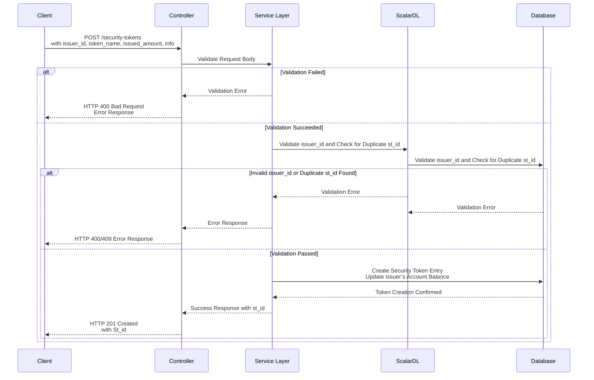

# API Design: Create Security Token (ST)

## Overview
This API facilitates the creation of a new security token (ST) for off-chain transactions. It validates user input, integrates with a scalardl for state management, and ensures error handling to maintain system integrity.

---

## **API Endpoint**
`POST /security-tokens`

## **Summary**
Creates a new security token (ST) and associates it with the issuer.

---

## **Request Body**

| Name             | Description                              | Schema               |
|------------------|------------------------------------------|----------------------|
| CreateStRequest  | Details for creating the security token | `CreateStRequest`   |

### **Example Request Body**

```json
{
  "issuer_id": "issuer123",
  "token_name": "tokenABC",
  "issued_amount": 1000,
  "info": {
    "info_prop_1": "propertyValue"
  }
}
```

#### Responses

| HTTP Code | Description                                    | Response Body                           |
|-----------|------------------------------------------------|-----------------------------------------|
| 201       | Security token successfully created            | `{ "st_id": "issuer123-tokenABC" }`     |
| 400       | Bad Request.                                   | `Error` object                          |
| 404       | The requested resource does not exist          | `Error` object                          |
| 409       | Conflict. The specified ST-ID already exists   | `Error` object                          |
| 500       | Internal server error                          | `Error` object                          |


### **Example Response (201)**

```json
{
  "issuer_id": "issuer123-MyToken"
}
```

### **Error Responses**

#### **Bad Request (400)**
```json
{
  "error": "Issued amount must be positive"
}
```
#### **Not Found   (404)**
```json
{
  "error": "The requested resource does not exist"
}
```
#### **Conflict  (409)**
```json
{
  "error": "Conflict. The specified ST-ID already exists"
}
```
#### **Internal Server Error (500)**
```json
{
  "error": "An unexpected error occurred"
}
```
### Sample Sequence Diagram



### **Procedure**
1. Initiates a POST request with `issuerId`, `tokenName`, `amount`, and `info`.
2.  Validates the request and forwards it to the service layer.
3. - Validates data against scalardl state.
   - Ensures no conflicts (e.g., duplicate `st_id`, invalid `issuerId`).
4. Confirms the validity of `issuerId` and checks for existing `st_id` conflicts.
5. Creates the token entry and updates the issuer’s account balances.
6. Returns success response with `st_id` or propagates errors to the controller.
7. Sends appropriate HTTP response to the frontend.

---

