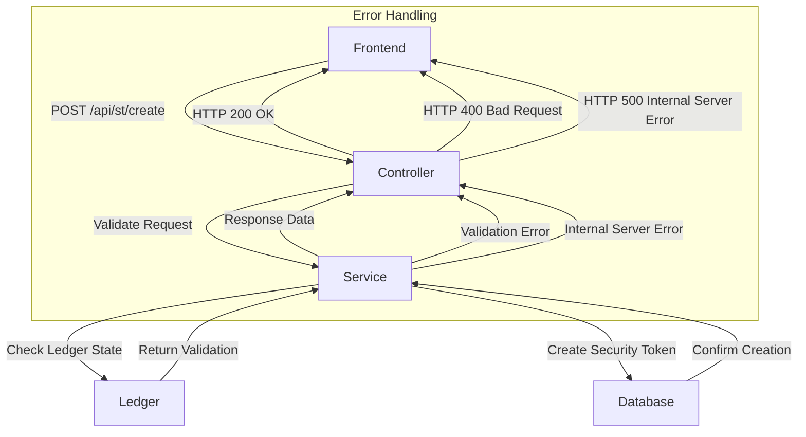

# API Design: Create Security Token (ST)

## Overview
This API facilitates the creation of a new security token (ST) for off-chain transactions. It validates user input, integrates with a ledger for state management, and ensures error handling to maintain system integrity.

---

## **Endpoint**
`POST /api/st/create`

## **Summary**
Creates a new security token (ST) and associates it with the issuer.

---

## **Request Body**

| Name             | Description                              | Schema               |
|------------------|------------------------------------------|----------------------|
| CreateStRequest  | Details for creating the security token | `CreateStRequest`   |

### **Example Request Body**

```json
{
  "issuerId": "issuer123",
  "tokenName": "MyToken",
  "amount": 1000,
  "info": {
    "description": "Sample token",
    "details": {
      "type": "utility"
    }
  }
}
```

### **Field Descriptions**

- **issuerId** *(String)*: Unique identifier of the issuer creating the security token.
- **tokenName** *(String)*: Name of the security token.
- **amount** *(Integer)*: Number of tokens to issue (must be positive).
- **info** *(Object/String)*: Additional token information, either as a JSON object or a valid JSON string.

---

## **Responses**

| HTTP Code | Description                                  | Response Body           |
|-----------|----------------------------------------------|-------------------------|
| 200       | Security token successfully created          | `CreateStResponse`      |
| 400       | Bad request (e.g., invalid input)            | `Error` object          |
| 500       | Internal server error                        | `Error` object          |

### **Example Response (200)**

```json
{
  "st_id": "issuer123-MyToken"
}
```

### **Field Descriptions**

- **st_id** *(String)*: Unique identifier for the created security token.

### **Error Responses**

#### **Bad Request (400)**
```json
{
  "error": "Issued amount must be positive"
}
```

#### **Internal Server Error (500)**
```json
{
  "error": "An unexpected error occurred"
}
```

---

## **Validation and Notes**

1. **Input Validation:**
   - All fields are mandatory.
   - `amount` must be a positive integer.

2. **Info Field:**
   - Accepts either a JSON object or a valid JSON string. Throws an error if neither is valid.

3. **Ledger Integration:**
   - Checks for conflicts:
     - Duplicate `st_id` (e.g., ST with the same ID already exists).
     - Non-existent `issuerId` (e.g., issuer account not found in the ledger).

4. **State Management:**
   - Updates the issuer’s account with the token balance after successful creation.

5. **Error Handling:**
   - Provides detailed error messages for invalid inputs or unexpected issues.

---

## **Sequence Diagram**



### **Procedure**
1. **Frontend:** Initiates a POST request with `issuerId`, `tokenName`, `amount`, and `info`.
2. **Controller:** Validates the request and forwards it to the service layer.
3. **Service:**
   - Validates data against ledger state.
   - Ensures no conflicts (e.g., duplicate `st_id`, invalid `issuerId`).
4. **Ledger:** Confirms the validity of `issuerId` and checks for existing `st_id` conflicts.
5. **Database:** Creates the token entry and updates the issuer’s account balances.
6. **Service:** Returns success response with `st_id` or propagates errors to the controller.
7. **Controller:** Sends appropriate HTTP response to the frontend.

---

## **Scenarios**

### Success Workflow
1. **Input:**
   ```json
   {
     "issuerId": "issuer123",
     "tokenName": "MyToken",
     "amount": 1000,
     "info": {
       "description": "Sample token",
       "details": {
         "type": "utility"
       }
     }
   }
   ```
2. **Output:**
   ```json
   {
     "st_id": "issuer123-MyToken"
   }
   ```
3. **HTTP Code:** `200`

### Error Scenarios
#### Duplicate `st_id`
- **Input:**
  ```json
  {
    "issuerId": "issuer123",
    "tokenName": "MyToken",
    "amount": 1000,
    "info": {}
  }
  ```
- **Output:**
  ```json
  {
    "error": "Token with ID 'issuer123-MyToken' already exists."
  }
  ```
- **HTTP Code:** `400`

#### Invalid `issuerId`
- **Input:**
  ```json
  {
    "issuerId": "invalidIssuer",
    "tokenName": "NewToken",
    "amount": 500,
    "info": {}
  }
  ```
- **Output:**
  ```json
  {
    "error": "Issuer ID 'invalidIssuer' does not exist."
  }
  ```
- **HTTP Code:** `400`
