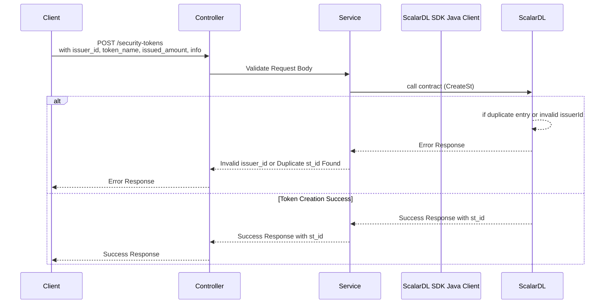

# API Design: Create Security Token (ST)

## Overview

This API creates a security token (ST) using ScalarDL. It ensures input validation, interacts with ScalarDL for token creation, and handles potential errors like duplicate token IDs or invalid issuer IDs.

---

### Sequence Diagram

### **Procedure**
1. Initiates a POST request with `issuerId`, `tokenName`, `amount`, and `info`.
2.  Controller forwards the request to Service for processing.
3.  Validates the request and forwards it to the service layer.
4.  Service calls ScalarDL and create the token.
5. If a duplicate st_id or invalid issuerId is detected, an error response is returned.
6. If successful, ScalarDL returns the created `st_id`, and the Client receives a success response.
