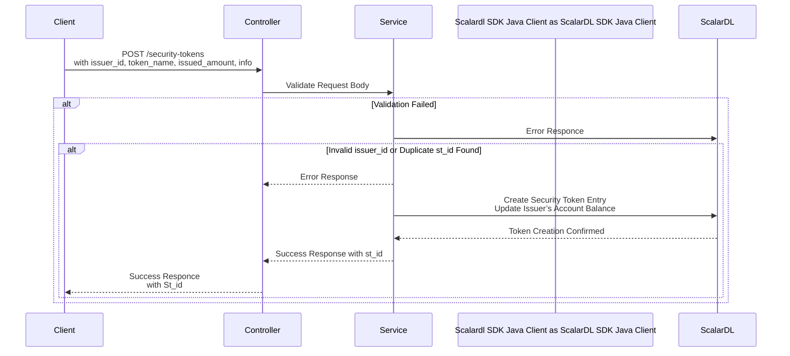

```mermaid
sequenceDiagram
    participant Client as Client
    participant Controller as Controller
    participant Service as Service
    participant Scalardl SDK Java Client as ScalarDL SDK Java Client 
    participant Scalardl as ScalarDL
   

    Client ->> Controller: POST /security-tokens<br/>with issuer_id, token_name, issued_amount, info
    Controller ->> Service: Validate Request Body
    alt Validation Failed
        Service ->> Scalardl:  Error Responce
        alt Invalid issuer_id or Duplicate st_id Found
            Service -->> Controller: Error Response
            Service ->> Scalardl: Create Security Token Entry<br/>Update Issuer’s Account Balance
            Scalardl -->> Service: Token Creation Confirmed
            Service -->> Controller: Success Response with st_id
            Controller -->> Client: Success Responce<br/>with St_id
        end
    end
```
