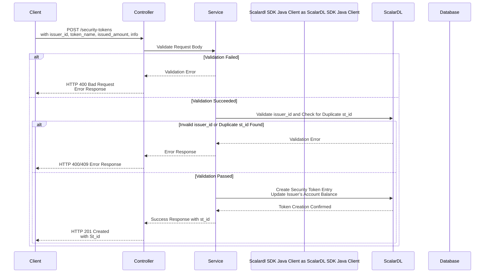

```mermaid
sequenceDiagram
    participant Client as Client
    participant Controller as Controller
    participant Service as Service
    participant Scalardl SDK Java Client as ScalarDL SDK Java Client 
    participant Scalardl as ScalarDL
    participant Database as Database

    Client ->> Controller: POST /security-tokens<br/>with issuer_id, token_name, issued_amount, info
    Controller ->> Service: Validate Request Body
    alt Validation Failed
        Service -->> Controller: Validation Error
        Controller -->> Client: HTTP 400 Bad Request<br/>Error Response
    else Validation Succeeded
        Service ->> Scalardl: Validate issuer_id and Check for Duplicate st_id
        alt Invalid issuer_id or Duplicate st_id Found
            Scalardl -->> Service: Validation Error
            Service -->> Controller: Error Response
            Controller -->> Client: HTTP 400/409 Error Response
        else Validation Passed
            Service ->> Scalardl: Create Security Token Entry<br/>Update Issuer’s Account Balance
            Scalardl -->> Service: Token Creation Confirmed
            Service -->> Controller: Success Response with st_id
            Controller -->> Client: HTTP 201 Created<br/>with St_id
        end
    end
```
