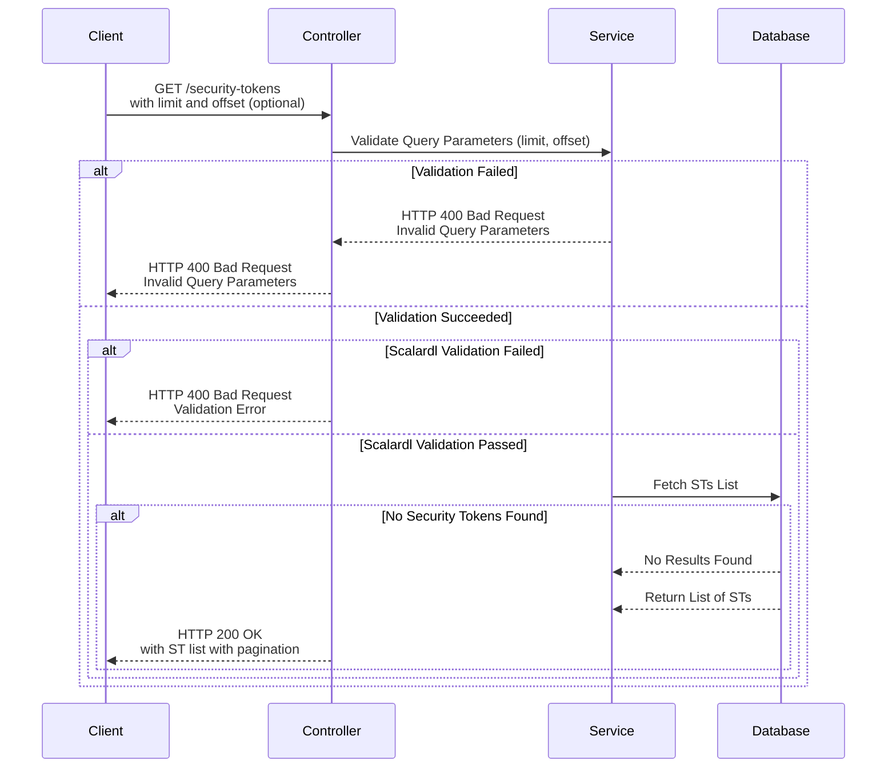

### Sample Sequence Diagram

```mermaid
sequenceDiagram
    participant Client as Client
    participant Controller as Controller
    participant Service as Service
    participant Database as Database

    Client ->> Controller: GET /security-tokens<br/>with limit and offset (optional)
    Controller ->> Service: Validate Query Parameters (limit, offset)
    alt Validation Failed
        Service -->> Controller: HTTP 400 Bad Request<br/>Invalid Query Parameters
        Controller -->> Client: HTTP 400 Bad Request<br/>Invalid Query Parameters
    else Validation Succeeded
        alt Scalardl Validation Failed
            Controller -->> Client: HTTP 400 Bad Request<br/>Validation Error
        else Scalardl Validation Passed
            Service ->> Database: Fetch STs List
            alt No Security Tokens Found
                Database -->> Service: No Results Found
                Database -->> Service: Return List of STs
                Controller -->> Client: HTTP 200 OK<br/>with ST list with pagination
            end
        end
end
```
