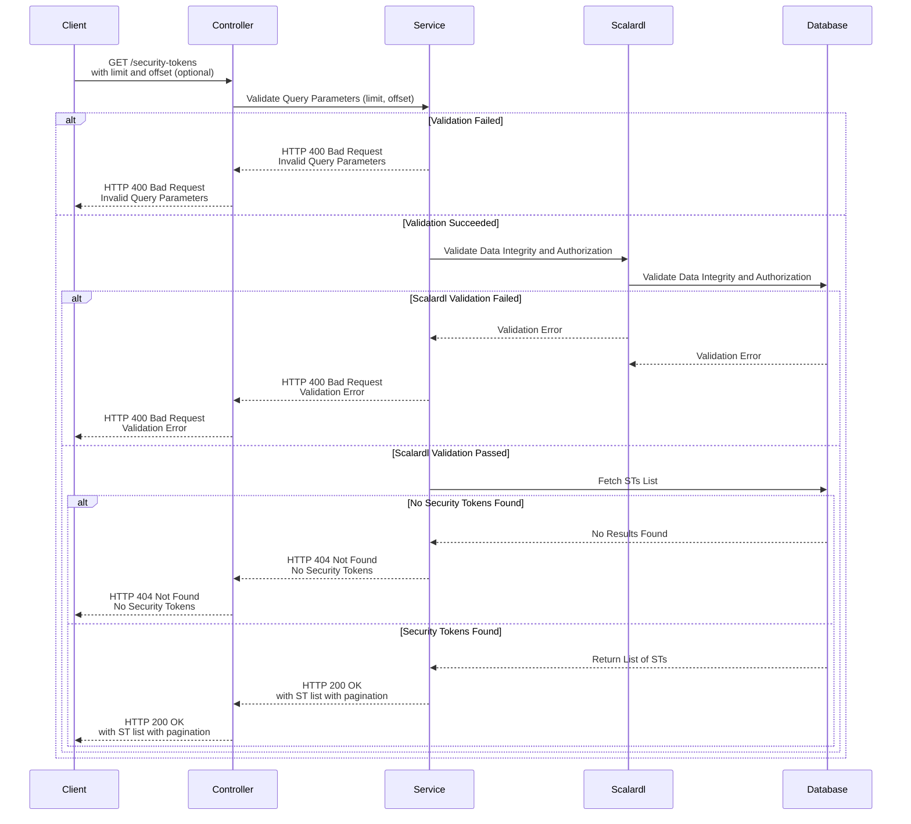

# API Design: List Security Tokens (STs)

## Overview
This API retrieves a list of all security tokens (STs), supporting pagination for efficient data management. It validates query parameters and handles errors gracefully to ensure a reliable experience.

---

### Sequence Diagram

---

## **Procedure**

1.  Sends a `GET` request to `/security-tokens` with optional query parameters `limit` and `offset`.
2.  Handles the request:
   - Validates the query parameters:
     - Ensures `limit` is a positive integer.
     - Ensures `offset` is a non-negative integer.
   - Fetches the list of STs from the database, applying pagination based on limit and offset.
3.  Executes the query to retrieve the ST list. 
4.  Returns the retrieved list or propagates errors:
   - Sends the array of ST objects.
   - Sends appropriate status codes and error messages.

---

